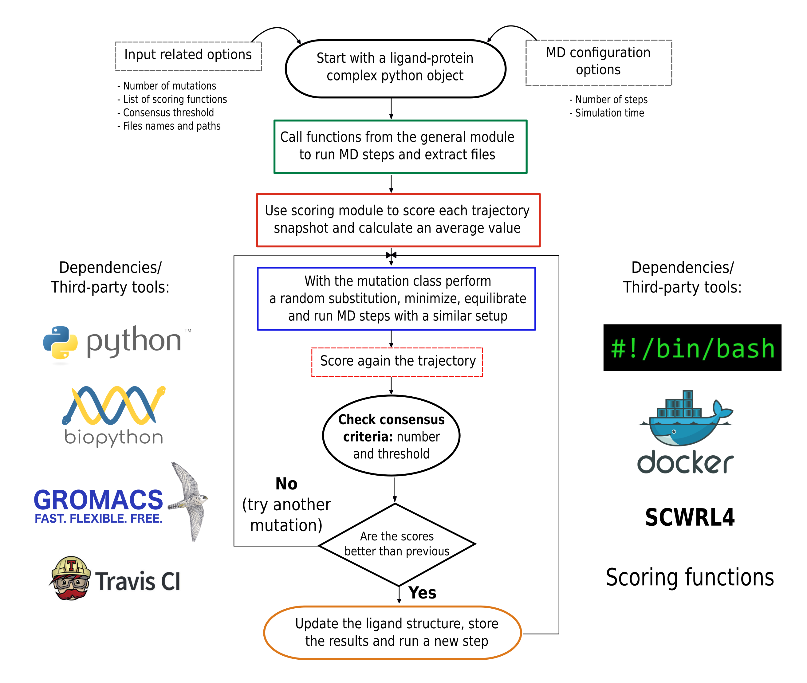

# PARCE

### Purpose

Here we present PARCE, an open source Protocol for Amino acid Refinement through Computational Evolution that implements an advanced and promising method for the design of peptides and proteins. The protocol performs a random mutation in the binder sequence, then samples the bound conformations using molecular dynamics simulations, and evaluates the protein-protein interactions from multiple scoring. Finally, it accepts or rejects the mutation by applying a consensus criterion based on binding scores. The procedure is iterated with the aim to explore efficiently novel sequences with potential better affinities toward their targets. **This is explained in a graphical summary:**




### Third-party tools:

- Scwrl4 (optional): http://dunbrack.fccc.edu/scwrl4/license/index.html
- Gromacs 5.1.4 (tested version): http://manual.gromacs.org/documentation/5.1.4/download.html

**NOTE: Path to both executables can be provided in the configuration file**

Scwrl4 can be installed freely after filling a form available in the website to obtain an academic license. **Please verify the permissions to run the program**. Gromacs 5.1.4 **(version tested in the protocol)** can be compiled and installed using the source code. The scoring functions are provided in the **src** folder and configured to run the analysis. 

**NOTE: An additional open source method to perform the single-point mutations, named FASPR (https://zhanglab.ccmb.med.umich.edu/FASPR/), is available in the code. The executable is included within the src folder and is the recommended option in case Scwrl4 cannot be installed.**

The BioPython and additional python modules can be installed directly from the OS repositories. An example in Ubuntu 16.04 is:

```
sudo apt-get install pdb2pqr
sudo apt-get install python3-biopython
sudo apt-get install python3-pip
sudo apt-get install python3-tk
sudo apt-get install python3-yaml
pip3 install GromacsWrapper
```

**NOTE: A `install_dependencies.sh` file is provided to automatize the installation of dependencies in the Linux (Ubuntu) operating system**

## Input files required

To run the protocol, **it is required to previously run a simulation in Gromacs with the system of interest**. After that, the following input files are required:

- A PDB file containing the starting system, including the protein, peptide and solvent. **Ideally renumber the chains to start from position 1 at each chain**
- The topology files of the structure chains
- (Optional) A GRO file of the PDB template structure
- (Optional) Files with itp extensions that selects the atoms restrained during the simulations

## MDP files for Gromacs MD simulations

The protocol has included a set of mdp files (with fixed names) to run the multiple minimization steps, the NVT equilibrations and the NPT production stages. The parameters have been optimized for the protocol efficiency and accuracy. **However, if these parameters are going to be modified by the user, the source files can be found in the folder src/start/mdp. The default temperature of the system is 310K.**

